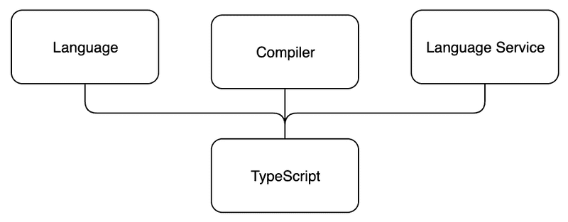

# Typescript

## Introduction

Typescript is a typed superset of Javascript, meaning that all existing Javascript code is valid typescript. Code written in Typescript has to then be transpiled (though the process is often referred to as compilation, which strictly speaking refers to the conversion to machine code) into Javascript, because Javascript runtimes (like browsers) don't understand Typescript natively.



## Types

### Primitives

Typescript has the following primitive types:
- `number`
- `string`
- `boolean`

### number vs Number

Aside from the primitives above, Javascript also has the types Number, String and Boolean (with capital letters). These types are not primitives, rather they are non-primitive boxed objects. They are object versions of the primitive, they are classes. We can use them as constructors to create the primitive, for example 

```
let stringNumber: string = "120";
let numberNumber: number = Number(stringNumber);
```

These object types are for example also present in Java. They are reference types, unlike their primitive counterparts. They can be used in generics, such as `List<Integer>`, which primitives can't in Java.

### Dealing with unknown (external data)

It also has these two types for situations when we cannot be sure of the type (like when getting data from an external source):
- `any`
- `unknown`

The main difference is that we cannot assign variables of type `unknown` to variables of a specific type without an explicit assertion:

```
let vAny: any = 10;          // We can assign anything to any
let vUnknown: unknown =  10; // We can assign anything to unknown just like any 


let s1: string = vAny;     // Any is assignable to anything 
let s2: string = vUnknown; // Invalid

vAny.method();     // Ok; anything goes with any
vUnknown.method(); // Not ok; we don't know anything about this variable
```

### Arrays

There are two equivalent kinds of syntax to indicate an array:
- `Array<number>`
- `number[]`

### Union types

When a variable can have one of many types, we define that using OR operator syntax:
`number | string`

### Creating our own types

Other than using primitives, we can also define our own types in Typescript. There are two main kinds of types we would want to define - object types and literal types.

#### Object types

If we have an object which has a consistent structure and we use it in multiple places in our code, we might want to define our own type for it. This can be done either using `type` notation or `interface` notation. There are very little differences between the two in typical use. We would declare them as follows:

```
type Point {
  x: number;
  y: number;
}

interface Person {
    name: string;
    age: number;
    phone?: string; // optional property - may or may not be defined
}
```

#### Literal types

We can also define literal types, where the type is a set of values:

```
type Rating: 1 | 2 | 3;
```


## Using Typescript

### Installation and configuration

We want to start by installing typescript as a dev dependency:

` npm install typescript --save-dev`

We will then run `npm run tsc -- --init`. which will initialize the `tsconfig.json` file. The options we specify in this file will determine how strict the compiler will be with our code and typing. 

Our project files can then be compiled from Typescript to Javascript by running `npm run tsc`. The production build will then be generated in the location we specify in `outDir` in the `tsconfig.json` file.

Another tool we might want to use is ESlint, which has support for Typescript, and enables to set more options. A particularly useful option, set by default when using ESLint with Typescript is `no-explicit-any`. This will ensure that all of our variables are properly typed.

In order to get our server to restart when we make code changes, we previously used `nodemon`. The typescript equivalent is `npm install --save-dev ts-node-dev`.

#### External libraries

When using external libraries, such as express or React, we willl want to install `@types/{npm_package_name}` to make the code of the library typed. These `@types` packages are amintained by *Definitely typed*, a community project. 


### Annotating

The way we indicate types of variables is through annotations:

```
let name: string = "Chris"
```

We should also annotate parameters and return types in functions: 

```
function greet(name: string): string {
  return `Hello ${name}`;
}

const sum = (x: number, y: number): number => {
  return x + y;
}
```

### Narrowing

Suppose we are getting data whose type we don't know. We can use narrowing in order to determine the type and be able to annotate a variable correctly. For primitives, we would typically narrow us `typeof` type guards:

```
// data sent by client, we cannot know its type
const heightInput: any = req.body.height;
if (!(typeof heightInput === "number") {
  throw new Error("height is not a number");
}
const height: number = heightInput;
```

For instances, we can use the `instanceof` function to check type. This is typically done when catching errors:

```
try {
  console.log(calculator(1, 5 , 'divide'));
} catch (error: unknown) {
  let errorMessage = 'Something went wrong.'
  if (error instanceof Error) {
    errorMessage += ' Error: ' + error.message;
  }
  console.log(errorMessage);
}
```

To check if we're dealing with an array:

```
if (!Array.isArray(vUnknown)) {
  throw new Error("vUnknown is not an array");
}

let a1: unknown[] = vAny;
```

#### Typeguards

Typically we will probably want to factor type checking / narrowing functionality out into functions specific for that. *typeguards* are functions which have a type predicate and return a boolean. For example: 

```
const isString = (text: unknown): text is string => {
  return typeof text === "string" || text instanceof String;
};
```

The return type has form `argname is type`. 


### Asserting

Sometimes the Typescript compiler is not able to tell that we've checked that a given variable has a given type. In these cases, we can use assertions to tell the compiler that it should trust that we know the type. This is the case for example when we check array values in a loop.

```
const dailyExercisesArray: Array<any> = dailyExercisesInput;

const dailyExercisesNumeric: number[] = <number[]>dailyExercisesArray.map((item: any) => {
  if (!isNaN(Number(item))) {
    return Number(item);
  }
});
```

The `<number>[]` before the map call on the right side of the assignment operator tells the compiler that the value is an array of numbers. Without it, the compiler complains that we cannot assign an array of any to an array of numbers, in spite of the fact that we check each value.

There is also an alternative, equivalent syntax `as number[]` which is used after the variable whose type we are asserting.